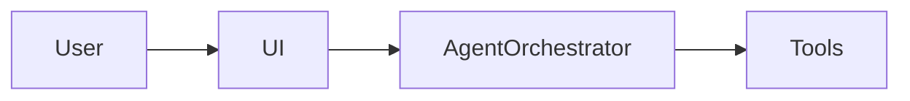

# {中文名} · 实施方案（{状态：草案 | 已确认}）

> 关联仓库：`TheFool-yiqi/{repo_slug}`  
> 作品集集成：`developerprofiles` → `npm run build:site`  
> 线上预览路径：`/{kebab-subpath}/`  
> 文档来源：需求文档、技术架构文档、AGENTS.md

## 已确认决策

| 类别 | 决策 |
|------|------|
| 仓库名 | `{repo_slug}` |
| 子路径 | `/{kebab-subpath}/` |
| 本地目录 | `../{repo_slug}` |
| 本地端口 | `{port}` |
| 首版范围 | {MVP 范围，如 P0 / P0+P1} |
| 测试 | {Vitest / 无 / 其他} |
| 技术栈 | {来自架构文档} |
| 视觉/交互 | {一句话} |
| 简历表述 | {Agent / 前端 / 全栈 侧重} |
| 预览方式 | {同域子路径 / 外链 / 仅源码} |

## 产品摘要（来自需求文档）

{2–4 句：用户、核心场景、差异化}

## 架构摘要（来自技术架构文档）

{模块划分、关键数据流、Agent 拓扑 — 可用 mermaid}



## Agent 摘要（来自 AGENTS.md）

| Agent / 角色 | 职责 |
|--------------|------|
| {name} | {duty} |

## 部署架构

```text
GitHub push
    → Webify: npm run build:site
        → dist/
        → dist/student-ddl/
        → dist/startrail-notes/
        → dist/traveler-weather/
        → dist/{kebab-subpath}/
    → 国内 CDN 同域访问
```

## 本地开发

```bash
cd {repo_slug}
npm install
npm run dev          # http://127.0.0.1:{port}

cd ../developerprofiles && npm run dev   # :3000
```

## 作品集卡片文案（profile.ts）

- **标题**：{中文名（English）}
- **描述**：{draft — refine in Phase 3}
- **tech**：{tag list}

## 验收清单（首版展示）

- [ ] 核心 MVP 功能可演示
- [ ] 子应用 `build:portfolio` 成功
- [ ] 作品集新卡片预览 → `/{kebab-subpath}/`
- [ ] 「返回作品集」链接正常
- [ ] `npm run build:site` 无错误
- [ ] 封面图 `public/projects/{slug}-cover.png`

## 待确认问题（Phase 3 后删除本节）

1. {question}
2. {question}

## 后续版本（可选）

- {来自需求文档的非首版项}
